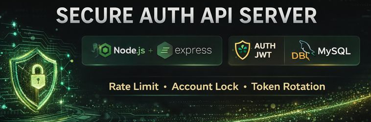

<p align="center">
  
</p>

<p align="center">
  <h1 align="center">Secure Auth API Server</h1>
</p>

<p align="center">
  Node.js · Express · JWT · MySQL 기반 보안 인증 시스템
</p>

<p align="center">
  
  
  
  
</p>

---

## Project Overview

본 프로젝트는 **실제 서비스 환경에서 요구되는 보안 인증 흐름을 직접 구현하는 것을 목표로 한 API 서버 프로젝트**입니다.

단순 로그인 API 구현을 넘어,

- 계정 잠금(Account Lock)
- 로그인 시도 제한(Rate Limiting)
- Refresh Token Rotation
- 토큰 재사용 공격 감지
- 인증 이벤트 로그 기록(Audit Log)
- 관리자 전용 로그 조회 API

등 **운영 환경 보안 요구사항을 반영한 인증 시스템 구조**를 구현했습니다.

---

## Why This Project

JWT 인증은 대부분의 서비스에서 기본으로 사용되지만,  
실무 환경에서는 단순 토큰 발급만으로는 보안이 충분하지 않습니다.

본 프로젝트는 다음을 목표로 설계되었습니다.

- 브루트포스 공격 대응
- 토큰 탈취 및 재사용 공격 방어
- 로그인 이벤트 감사 로그 구축
- 관리자 모니터링 API 설계
- 실무 수준 인증 보안 구조 학습

---

## Technical Highlights

| Area | Description |
------|------
Authentication | JWT Access + Refresh Token 구조  
Token Security | Refresh Token Rotation + 재사용 감지  
Account Protection | 로그인 실패 기반 계정 잠금  
Rate Limiting | 로그인 API 요청 제한  
IP Protection | 반복 공격 IP 자동 차단  
Audit Logging | 인증 이벤트 DB 저장  
Admin API | 관리자 전용 로그 조회 엔드포인트  

---

## Project Structure

```bash
.
├── src
│   ├── app.js
│   ├── db.js
│
│   ├── controllers
│   │   └── authController.js
│
│   ├── routes
│   │   ├── authRoutes.js
│   │   └── adminRoutes.js
│
│   ├── middlewares
│   │   ├── loginRateLimit.js
│   │   ├── ipBanCheck.js
│   │   └── adminAuth.js
│
├── .env
├── package.json
├── README.md
└── images
```

---

## System Architecture
```

            Client (Postman / Browser)
                         │
                         ▼
                ┌───────────────────┐
                │   Express Server   │
                │-------------------│
                │ JWT Auth           │
                │ Rate Limit         │
                │ Account Lock       │
                │ Token Rotation     │
                │ IP Ban Middleware  │
                └─────────┬─────────┘
                          │
                          ▼
                ┌───────────────────┐
                │       MySQL        │
                │-------------------│
                │ users              │
                │ auth_logs          │
                │ banned_ips         │
                └───────────────────┘
```

---

## Authentication Flow

### Login Flow

1. 로그인 요청 수신
2. IP 차단 여부 확인
3. Rate Limit 검사
4. 계정 잠금 여부 검사
5. 비밀번호 검증
6. Access Token + Refresh Token 발급
7. Refresh Token 해시 DB 저장
8. 인증 로그 기록

### Refresh Token Rotation Flow

1. Refresh 요청
2. DB 해시와 쿠키 토큰 비교
3. 정상 → 새 Access Token 발급
4. 재사용 감지 시:
   - 요청 차단
   - 로그 기록
   - 공격 이벤트 저장

---

## Security Features

### Account Lock
- 로그인 실패 횟수 누적
- 임계값 초과 시 계정 자동 잠금
- 잠금 만료 시 자동 해제

### Rate Limiting

- 로그인 API 요청 제한
- 브루트포스 공격 방어 목적

### IP Ban System

- 반복 공격 IP DB 저장
- 차단 IP 요청 즉시 거부

### Audit Logging

- 인증 관련 모든 이벤트 저장

| Event |
|-|
|LOGIN_SUCCESS|
|INVALID_CREDENTIALS|
|ACCOUNT_LOCKED|
|REFRESH_ROTATED|
|REFRESH_REUSE_DETECTED|

---

## Database Schema

### users

| Column             | Description      |
| ------------------ | ---------------- |
| id                 | PK               |
| email              | 로그인 계정           |
| password_hash      | 비밀번호 해시          |
| login_fail_count   | 실패 횟수            |
| locked_until       | 잠금 만료 시각         |
| refresh_token_hash | Refresh Token 해시 |

### auth_logs
| Column      | Description |
| ----------- | ----------- |
| email       | 시도 계정       |
| ip_address  | 요청 IP       |
| user_agent  | 브라우저 정보     |
| success     | 성공 여부       |
| fail_reason | 실패 사유       |
| created_at  | 이벤트 시각      |


### banned_lps
| Column     | Description |
| ---------- | ----------- |
| ip_address | 차단 IP       |
| reason     | 차단 사유       |
| created_at | 차단 시각       |

---

## Admin API
- 관리자 전용 API : 최근 인증 로그 조회
```
GET /admin/auth-logs
```

---

## Getting Started

### 1. Install Packages
```
npm install
```

### 2. Environment Setup
```
.env
```

```
PORT=4000

DB_HOST=localhost
DB_USER=root
DB_PASSWORD=your_password
DB_NAME=secure_auth

JWT_ACCESS_SECRET=your_access_secret
JWT_REFRESH_SECRET=your_refresh_secret

ACCESS_TOKEN_EXPIRES_IN=15m
REFRESH_TOKEN_EXPIRES_IN=7d

MAX_LOGIN_FAILS=5
LOCK_MINUTES=10
```

### 3. Run Server
```
npm run dev
```

---

## What I Learned

- JWT 인증 구조 설계
- Refresh Token Rotation 구현
- 계정 보호 로직 설계
- 브루트포스 공격 대응 전략
- API 보안 로그 시스템 구축
- 실무형 인증 아키텍처 경험

---

## Future Improvements

- [ ] Redis 기반 Rate Limit 적용
- [ ] 2FA (OTP 인증) 추가
- [ ] OAuth 로그인 연동
- [ ] 관리자 웹 대시보드 구축
- [ ] 보안 이벤트 모니터링 시스템 연동

---
## Note

본 프로젝트는 보안 인증 구조 학습 및 실무 패턴 실습 목적으로 제작되었습니다.
